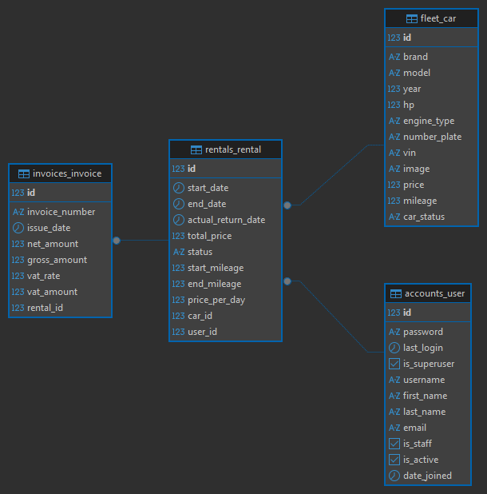
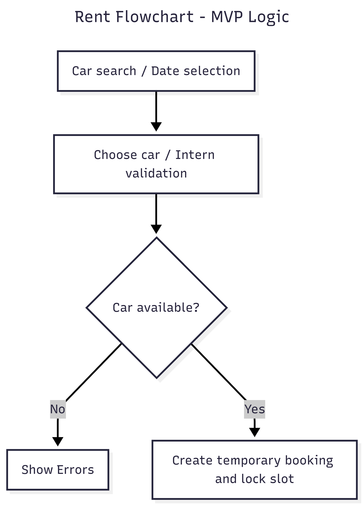
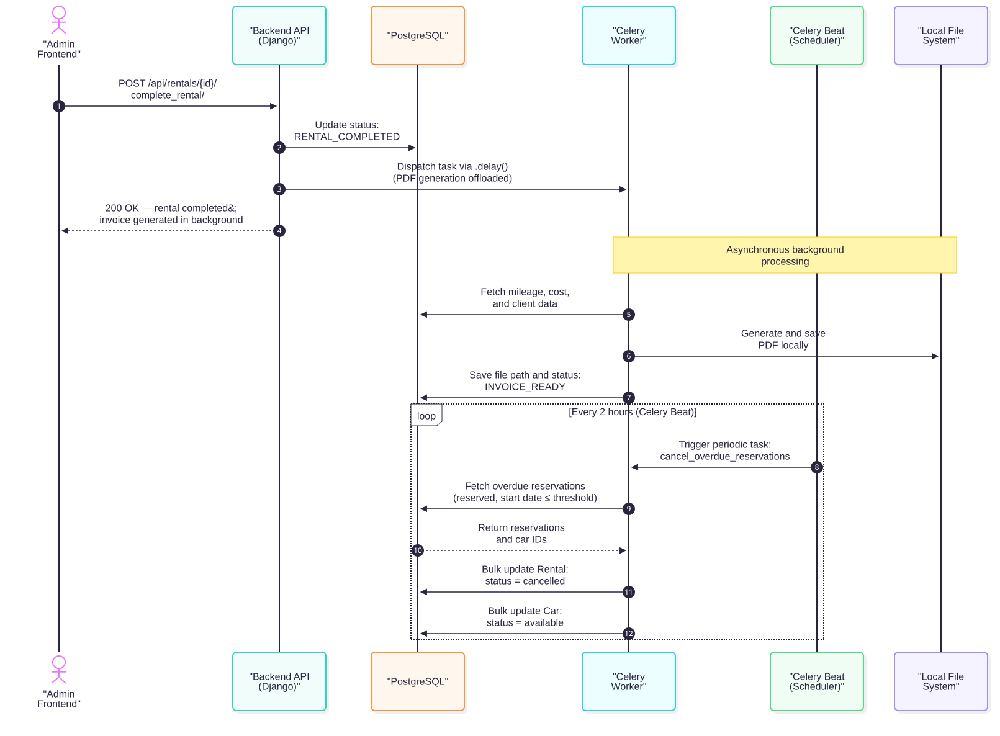

# Car Rental API

[](https://github.com/RumaxDA/rent_car_django/actions)
[](https://github.com/RumaxDA/rent_car_django/actions)

A robust, backend-only RESTful API built for managing a car rental service. Designed with a clear separation of business logic (Service Layer pattern) and heavy emphasis on data validation, security, and role-based access control.

## 🚀 Live Demo

You can test the API live here (available daily from 06:00 to 20:00 CEST / UTC+2):
**[https://rent-cars.ddns.net/api/docs/](https://rent-cars.ddns.net/api/docs/)**

> _Coming Soon: The database will be reset periodically to maintain a clean environment for testing._

## Tech Stack

- **Framework:** Django & Django REST Framework (DRF)
- **Authentication:** JSON Web Tokens (JWT)
- **Database:** PostgreSQL 17
- **CI:** GitHub Actions (Automated Linting via Flake8 & Black and Testing via Pytest)
- **Server & Static Files:** Gunicorn, WhiteNoise
- **Testing:** Pytest (with fixtures)
- **Documentation:** OpenAPI / Swagger UI
- **Infrastructure:** Docker & Docker Compose
- **Deployment:** Nginx (Reverse Proxy), Gunicorn, SSL (Let's Encrypt)
- **Cloud Infrastructure:** AWS (EC2, Security Groups)
- **Asynchronous Tasks:** Redis & Celery (handles background PDF report generation and automatic check of missed reservations)

## Key Features

1. **Role-Based Access Control (RBAC):** Strict endpoint protection distinguishing between Admin, Logged-in Users, and Anonymous Users. Sensitive data is scoped exclusively to the data owner or administrators.
2. **Advanced Business Validation:** Prevents logical errors during rentals (e.g., overlapping rental dates, booking cars that are too old or out of service).
3. **External API Integration:** Automatically fetches car models from external providers.
4. **Service Layer Architecture:** Business logic is decoupled from views/serializers, ensuring clean, testable, and maintainable code.
5. **Comprehensive Testing:** Automated test suite powered by `pytest` and fixtures.
6. **Core CRUD Operations:** Complete management of Users, Cars, and Rentals.
7. **Query Optimization:** Built-in filtering and pagination for large datasets.
8. **Continuous Integration (CI):** Automated workflows enforcing strict PEP8 code quality standards and executing automated test suites (Pytest) on every pull request and push to the main branch.
9. **Cloud-Ready Deployment:** Containerized production environment hosted on AWS, utilizing Nginx as a reverse proxy, Gunicorn for WSGI handling, and Let's Encrypt for SSL/TLS security.

## Architecture

The application follows the **Service Layer pattern**, ensuring that business logic is completely decoupled from Django views. This allows for cleaner unit tests and higher maintainability.

### System Schemas & Visualizations

#### 1. Database ER Diagram

The core business domain model comprising users, cars, rentals, and invoices:


#### 2. Rental Process Flowchart

Visualizes status validation and logic flow during reservation creation and completion:


#### 3. Asynchronous Background Processes

Illustrates the integration of Celery workers for asynchronous PDF invoice generation and periodic checks:


## How to run

The project is fully containerized. You don't need to install Python or PostgreSQL on your local machine.

### Prerequisites

- Docker and Docker Compose installed.
- Docker Desktop or Docker Engine installed.

### Installation

**Step 1. Clone the repository**

```bash
git clone [https://github.com/RumaxDA/rent_car_django](https://github.com/RumaxDA/rent_car_django)
cd rent_car_django
```
